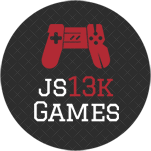
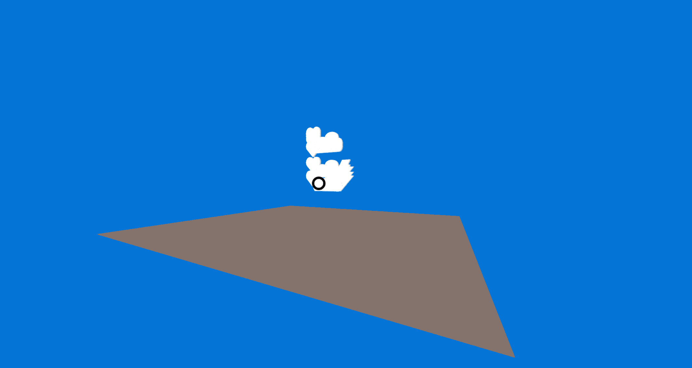

## Theme: BACK

* Put toys BACK into the toy box.
* Put the pieces BACK together!
* Place the items BACK in the right spot.





### Prerequisites

- You need [node](https://nodejs.org/en/download/current/) installed.

### Building & Zipping

```bash
make build.rollup
```

### Start server


```bash
make build.test
```

This will setup a server listening at `http://localhost:8080/`.


# JS13K A-Frame Boilerplate

This project started as a boilerplate based on [A-Frame](https://aframe.io/) and [Webpack](https://webpack.js.org/) for the [js13k competition](https://2019.js13kgames.com/).


## License

This project is licensed under the MIT License - see the [LICENSE](LICENSE) file for details

## References

* This project is based on [https://github.com/sz-piotr/js13k-webpack-starter](https://github.com/sz-piotr/js13k-webpack-starter) by Piotr Szlachciak.
