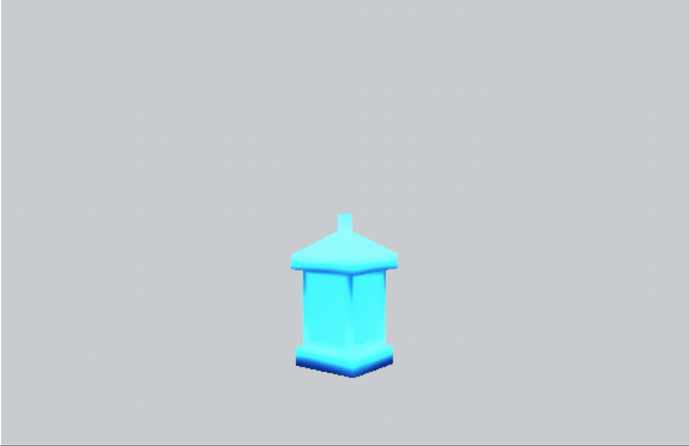

### Original Model

[Source on SketchFab](https://sketchfab.com/3d-models/low-poly-adventure-asset-pack-bda2fd1158df425fb703f53d926b1ec6)

# Study - Reducing the size of an existing model.

This model was designed to be *low poly* which means the artist created this using as few faces as possible. This model has 201 faces and 331 vertices. That is very tiny compared to something like this [Vending Machine](https://sketchfab.com/3d-models/vending-machine-242eaa6efeb3457a96a5086039583966) which has 2.1K faces and 1.1k vertices.

* Uncompressed  (Geometry and Materials): 420,128 bytes (411K)
* Compressed  (Geometry and Materials): **405,733 bytes (397K)**
* 201 Faces, 331 Vertices, Textures

## Premise
Model files are already optimized. But if we are willing to lose precision, we can create much smaller versions suitable for tiny code projects like JS13Kgames.

* Remove non-essential data that can be lost, or re-created. Some quality loss is acceptable.
* Convert to a format that has a lot of repeating strings to take advantage of GZIP compression.


## How

A [Geometry](https://threejs.org/docs/#api/en/core/Geometry) requires two things. A list of [Vector3](https://threejs.org/docs/#api/en/math/Vector3) called `vertices`; and a list of [Face3](https://threejs.org/docs/#api/en/core/Face3) called `faces`. In really requires just the faces, but each face requires three `Vector3` objects. To avoid duplication, the `Face3` holds the index to the `Vector3` it uses.

```
const { vertices, faces } = geometry;
// A face is made from three points
const point1 = vertices[faces[0].a];
const point2 = vertices[faces[0].b];
const point3 = vertices[faces[0].c];
```

Using a tool I created on [Codepen](https://codepen.io/ripter/full/vYYLQMY),  I can extract the vertices and faces from the model and create a compressed and uncompressed version of the files. I'll compare the resulting size to the original GLTF file and an OBJ version of the file to see if there is any hope.

* Uncompressed: 22,972 bytes (23K)
* Compressed: 2,675 bytes (2.7K)
* GLTF uncompressed: 22,789 bytes (23K)
* GLTF compressed: 7,843 bytes (7.7K)
* OBJ uncompressed: 25,690 bytes (26K)
* OBJ compressed: 7,860 bytes (7.7K)

I'm still missing a few things like rotation and texture, but the basic shape works.

To be fair in the comparison, I should remove the texture size from the GLTF file. The Texture is 399,522 bytes (401 KB).

* GLTF compressed no texture: **6,974 bytes (6.9K)**
* vertices/face array compressed: **2,675 bytes (2.7K)**

![rotating export](./media/extract_01.gif]

## Matrix and Rotation

As you can see in the screenshot above, the geometry is there but rotated the wrong way. There are two ways I can think of two fixes. I could either update all the vertices so they incorporate the position/rotation. I do not know how to do this, but I assume it can be done with math. The other way is to include the position and rotation information in the export. This way sounds easier, but something would like to avoid. It would increase the file size because I would need to store more metadata.

I've been trying to use applyMatrix, but so far I have not been successful.

After messing with it for two days. I've decided not to worry about the rotation. It's always possible to rotate the resulting mesh after the fact. It's not perfect, but good enough for now.


## Compression Idea: Faces Only

The idea is to only store the face array, and let the vertices duplicate. The zip compression should take care of the duplication. The result is smaller because it is no longer storing as much unique data.

Here is the old serialization code.

```
// Returns a minimized version of geometry.
function serializeGeometry(geo) {
  return {
    vertices: geo.vertices.map(vert => {
      return {
        x: round(vert.x),
        y: round(vert.y),
        z: round(vert.z)
      };
    }),
    faces: geo.faces.map(face => {
      return {
        a: face.a,
        b: face.b,
        c: face.c,
      };
    }),
  }
}
```


So I updated it to just be an array in sorted order.

```
function serializeGeometry(geo) {
  return geo.faces.reduce((acc, face) => {
    console.log('face', face);
    acc = acc.concat([
      round(geo.vertices[face.a].x),
      round(geo.vertices[face.a].y),
      round(geo.vertices[face.a].z),
      round(geo.vertices[face.b].x),
      round(geo.vertices[face.b].y),
      round(geo.vertices[face.b].z),
      round(geo.vertices[face.c].x),
      round(geo.vertices[face.c].y),
      round(geo.vertices[face.c].z),
    ]);
    return acc;
  }, []);
}

function round(x) {
  const num = Number.parseFloat(x);
  return (0|(num * 1000))/1000;
}
```

* Uncompressed: 18,081 bytes (18K)
* Compressed: **2,039 bytes (2.0K)**
* Old version compressed: 2,675 bytes (2.7K)


And then the code to turn it back into a THREE.Mesh
```


function deserializeGeometry(faceList) {
  const miniGeo = {
    vertices: [],
    faces: [],
  };

  for (let i=0; i < faceList.length - 9; i += 9) {
    const a = new THREE.Vector3(faceList[i+0], faceList[i+1], faceList[i+2]);
    const b = new THREE.Vector3(faceList[i+3], faceList[i+4], faceList[i+5]);
    const c = new THREE.Vector3(faceList[i+6], faceList[i+7], faceList[i+8]);

    miniGeo.vertices = miniGeo.vertices.concat([
      new THREE.Vector3(faceList[i+0], faceList[i+1], faceList[i+2]),
      new THREE.Vector3(faceList[i+3], faceList[i+4], faceList[i+5]),
      new THREE.Vector3(faceList[i+6], faceList[i+7], faceList[i+8]),
    ]);

    miniGeo.faces.push({
      a: miniGeo.vertices.length-3,
      b: miniGeo.vertices.length-2,
      c: miniGeo.vertices.length-1,
    });
  }

  return miniGeo;
}

const addByVertices = (vertices, faces) => {
  const material = new THREE.MeshToonMaterial({
    color: 0x2194ce,
  });
  const geometry = new THREE.Geometry();
  geometry.vertices = vertices;
  geometry.verticesNeedUpdate = true;
  geometry.faces = faces.map(face => new THREE.Face3(face.a, face.b, face.c));
  geometry.elementsNeedUpdate = true;
  geometry.mergeVertices();
  geometry.computeFaceNormals();
  geometry.computeVertexNormals();
  return new THREE.Mesh(geometry, material);
};

```


## Models Minified

### Lamp 985 bytes [saved 2,345 bytes]

