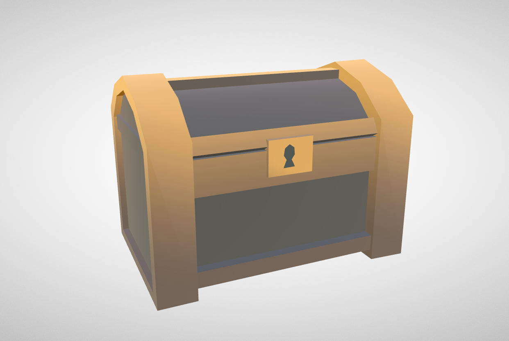
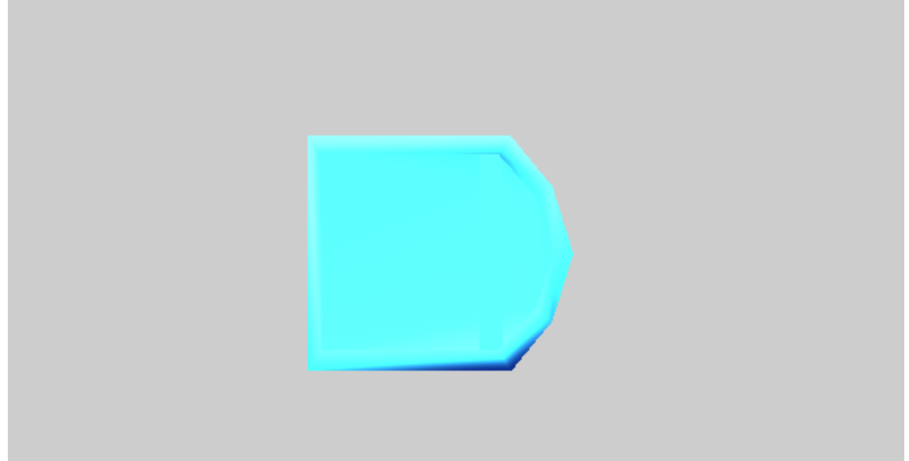

### Original Model

[Source on SketchFab](https://sketchfab.com/3d-models/low-poly-adventure-asset-pack-bda2fd1158df425fb703f53d926b1ec6)

# Study - Reducing the size of an existing model.

This model was designed to be *low poly* which means the artist created this using as few faces as possible. This model has 201 faces and 331 vertices. That is very tiny compared to something like this [Vending Machine](https://sketchfab.com/3d-models/vending-machine-242eaa6efeb3457a96a5086039583966) which has 2.1K faces and 1.1k vertices.

* Uncompressed: 420,128 bytes (411K)
* Compressed: 405,733 bytes (397K)
* 201 Faces, 331 Vertices, Textures

## Premise
Model files are already optimized. But if we are willing to lose precision, we can create much smaller versions suitable for tiny code projects like JS13Kgames.

* Remove non-essential data that can be lost, or re-created. Some quality loss is acceptable.
* Convert to a format that has a lot of repeating strings to take advantage of GZIP compression.


## How

A [Geometry](https://threejs.org/docs/#api/en/core/Geometry) requires two things. A list of `[Vector3](https://threejs.org/docs/#api/en/math/Vector3)` called vertices; and a list of `[Face3](https://threejs.org/docs/#api/en/core/Face3)` called faces. In really requires just the faces, but each face requires three `Vector3` objects. To avoid duplication, the `Face3` holds the index to the `Vector3` it uses.

```
const { vertices, faces } = geometry;
// A face is made from three points
const point1 = vertices[faces[0].a];
const point2 = vertices[faces[0].b];
const point3 = vertices[faces[0].c];
```

Using a tool I created on [Codepen](https://codepen.io/ripter/full/vYYLQMY),  I can extract the vertices and faces from the model and create a compressed and uncompressed version of the files. I'll compare the resulting size to the original GLTF file and an OBJ version of the file to see if there is any hope.

* Uncompressed: 22,972 bytes (23K)
* Compressed: **2,675 bytes (2.7K)**
* GLTF uncompressed: 22,789 bytes (23K)
* GLTF compressed: 7,843 bytes (7.7K)
* OBJ uncompressed: 25,690 bytes (26K)
* OBJ compressed: 7,860 bytes (7.7K)

I'm still missing a few things like rotation and texture, but the basic shape works.


