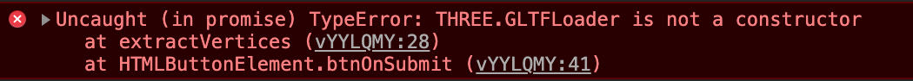

Live: https://codepen.io/ripter/full/vYYLQMY

### Prerequisites

- You need [node](https://nodejs.org/en/download/current/) installed.

## TL;DR
```bash
make
```
That will build from source, and then start the server.

### Building & Zipping

```bash
make build
```

### Start server


```bash
make server
```

This will setup a server listening at `http://localhost:8080/`.


### Original Model


# JS13K A-Frame Boilerplate

This project started as a boilerplate based on [A-Frame](https://aframe.io/) and [Webpack](https://webpack.js.org/) for the [js13k competition](https://2019.js13kgames.com/).


## License

This project is licensed under the MIT License - see the [LICENSE](LICENSE) file for details

## References

* This project is based on [https://github.com/sz-piotr/js13k-webpack-starter](https://github.com/sz-piotr/js13k-webpack-starter) by Piotr Szlachciak.


# Study - Reducing the size of an existing model.

The model is a cute [Vending Machine](https://sketchfab.com/3d-models/vending-machine-242eaa6efeb3457a96a5086039583966)

* GLB (Model + Textures): **2,663,596 bytes. (2.6MB)**
    * gziped: 1,950,561 bytes (2MB)
* GLTF & BIN (Models & Textures): **1,820,832 bytes. (1.8MB)**
    * GLTF: 15,382 bytes. (16KB)
    * BIN: 150,036 bytes. (150KB)
    * Textures: 1,655,414 bytes (1.6MB)
    * gziped: 1,564,319 bytes (1.6 MB on disk)


First surprising note. The GLB file, which is the model + the textures in one file, is larger than the files separated into a folder. I'm guessing the extra space comes from converting the files when they are added to the GLB. This is pretty good news. If we keep the texture images separate, we might be able to do something creative.

## Goal: 1,000 bytes.

My goal is to get this model down to only 1,000 bytes, including textures. Quality loss is acceptable. It feels ambitious since the file is starting from 1.8MB. I'll have to cut a lot of things out, and probably create a custom format for the files.

So where to start? There are several parts to a model file. But we don't display a model file in three.js or a-frame. We display a [Mesh](https://threejs.org/docs/#api/en/objects/Mesh).  So I'll start by focusing on the two things that make up a Mesh.

* [Geometry](https://threejs.org/docs/#api/en/core/Geometry)
* [Material](https://threejs.org/docs/#api/en/materials/Material)

Everything that is displayed in the 3D world needs at least three components. Geometry contains all of the vertices in the model. These vertices make up the points that make up the model. They are grouped into [Faces](https://threejs.org/docs/#api/en/core/Face3). The face describes how to render the material across the three vertices that make up the face. If you have had the issue where you can only see a model from one direction and not the other. It was because your face was inverted. Tools like Blender can automatically fix those issues in most cases.

Material describes the appearance. It is the colors, textures, filters, Alpha transparency, or even with [Skeletons for animations](https://threejs.org/docs/#api/en/objects/SkinnedMesh). In simple projects, it's a color applied over each face. But in most models, it will be several image files UV mapped over the model. That's what I want, UV mapping.

What is a UV map? It is the mapping of the faces to the texture/image. A texture is a typical 2d image. A jpeg, or png file. The UV mapping is how that 2D image is placed over the model.

So I have two main paths to optimize. The Geometry and the Material. The model file has loads of important metadata around the vertices. I'll just throw all that away and see how small I can make it. That sounds easier than trying to make images smaller, plus I need more info on how to do the UV mapping. I've never gotten that part to work before.

## Vertices

I have two goals here:
* Render a model from an array of vertices.
* Figure out how to extract the vertices from the model file. Probably the GLTF.

## Extracting vertices from GLTF files
The great news is that GLTF files are JSON files. I'll just open it up in my favorite [JSON Editor](http://jsoneditoronline.org/). We can find more information about what these fields mean with the [documentation](https://github.com/KhronosGroup/glTF/blob/master/specification/2.0/figures/gltfOverview-2.0.0b.png)

`buffer` data is the field buffers, which references the BIN file.

`bufferView` adds structure (aka metadata) about the data in the `buffer`.  This model has 4 `bufferViews` defined.

`accessors` describe the values to get out of the `bufferViews`.  This model has 26 accessors, mostly describing where in the bufferView they have `VEC3`, `VEC4`, and `SCALAR` values, including min/max/default values.


So, if I want to read a GLTF & BIN file, to get the vertex list, I'm going to have to do all of this work. I wonder if there are any existing tools out there that I could use. I am not thrilled to write code needed to decode all of that. But If I want to create a tool that will take a model and export the smaller file format. I will probably have too. Although, I could probably cheat a little. I could load the original file with THREE.js, let it decode the binary into a vertex list, and get the list from that. I like that idea. It will be less fragile, (THREE.js is well tested and maintained) and I will have to do less work. It might mean that I need a browser, however. I don't know if THREE.js can work on the command line, but it [looks possible](https://threejs.org/docs/#manual/en/buildTools/Testing-with-NPM).

### What I want
I want to pick/upload a gltf/glb file and get an array of vertices back.

### How I am going to get there
* I will load the file with [Three.JS GLTFLoader](https://threejs.org/docs/index.html#examples/en/loaders/GLTFLoader).
* I will extract the object vertices data from the asset.
* I will return an array of vertices.


This function will be async because we will be loading external data. So I will start by writing a function that returns a promise, using the new `async/await` format.

```
async function extractVertices(url) {

}
```

I'll just throw this up on a Codepen and share it with you.

[Tool: Extract Vertices from GLTF or GLB file](https://codepen.io/ripter/pen/vYYLQMY?editors=1010)

### First Issue



Uh, what? The [THREE.js docs](https://threejs.org/docs/index.html#examples/en/loaders/GLTFLoader.load) make it seem like I can just use it. So why am I getting an error that it does not exist?

If you search the issues, you get this sorta helpful one. https://github.com/mrdoob/three.js/issues/14826 where he says the GLTFLoader is not included by default. We have to include it ourselves. [GLTFLoader Source](https://github.com/mrdoob/three.js/blob/master/examples/js/loaders/GLTFLoader.js). [CDN host](https://threejs.org/examples/js/loaders/GLTFLoader.js)

I normally use A-Frame, which encourages GLTF models. So It must include the loader by default. Looking into it, A-Frame uses a fork of THREE.JS called [super-three](https://github.com/supermedium/three.js).


### Handling the response.

Next, I need to take the loaded GLTF data and extract the vertices. Which means I need to find them first. The response contains a scene, which has everything you would expect to find in a scene. Camera, Lighting, and our model!

```
loader.load(url, (gltf) => {
  // refrence: https://threejs.org/docs/#examples/en/loaders/GLTFLoader
  gltf.animations; // Array<THREE.AnimationClip>
  gltf.scene; // THREE.Scene
  gltf.scenes; // Array<THREE.Scene>
  gltf.cameras; // Array<THREE.Camera>
  gltf.asset; // Object
});
```


I don't care about the lighting or the camera. So a simple filter can remove those by name.
```
// Filter out children we don't care about by name.
const children = gltf.scene.children.filter(obj => ['Light', 'Camera'].indexOf(obj.name) === -1);
```

That results in an array with one [Object3D](https://threejs.org/docs/index.html#api/en/core/Object3D). The root of the model.

Just looking at the children returned, I noticed several layers of wrappers before I get close to Meshes.

```
// First place children.length > 1
gltf.scene.children[0].children[0].children[0].children
```

These children have a child called Mesh. That's getting close to what I want. A Mesh is made up of texture and geometry. The vertices are stored in the geometry. I poked around looking for an easy way to get the meshes but didn't find one. So time to write my own.

```
function findByType(children, type) {
  return children.reduce((acc, object3D) => {
    // If there are children, process them first.
    if (object3D.children.length > 0) {
      acc = acc.concat(findByType(object3D.children, type));
    }
    // Add it to the list if the type matches
    if (object3D.type === type) {
      acc.push(object3D);
    }
    // Return the list!
    return acc;
  }, []);
}
```


I had to switch back to Promise syntax because I don't understand how to do it with async. So here is the final version that returns the full Geometry object of each Mesh. That includes an array of vertices, so it meets the requirements.

```
function extractGeometries(url) {
  const loader = new THREE.GLTFLoader();
  loader.setCrossOrigin('anonymous');

  return new Promise((resolve, reject) => {
    loader.load(url, (gltf) => {
      // Filter out children we don't care about by name.
      const children = gltf.scene.children.filter(obj => ['Light', 'Camera'].indexOf(obj.name) === -1);
      // Get all the Meshes
      const meshList = findByType(children, 'Mesh');
      // Get the Geometries from each mesh
      const geometryList = meshList.map(mesh => {
        const geometry = new THREE.Geometry();
        geometry.fromBufferGeometry(mesh.geometry);
        geometry.mergeVertices();
        return geometry;
      });
      resolve(geometryList);
    }, (progress) => {
      // console.log('loading', progress);
    }, (error) => {
      reject(error);
    });
  });
}
```

### It works!

You can check it out [on codepen](https://codepen.io/ripter/pen/vYYLQMY?editors=0010)


Put in a URL for the GLTF/GLB model, and it will extract all the mesh vertices. Or just hit extract and let it work on the sample model.

* Uncompressed: **105,744 bytes (104K)**
* Compressed: **9,410 bytes (9.2K)**


9K might be acceptable in the JS13K game. I also wonder if I need all the meshes to render the model. I don't care about the mesh, the floor, or the sky. Right now I don't know if I'm getting that data or not.

There is one more easy compression I can add right now. Each point has 16 decimal places. This is great for accuracy, but we don't care if there is some data loss. So I can round those numbers to something much smaller, and easier to compress.

```
function round(x) {
  return Number.parseFloat(x).toFixed(3);
}

function btnOnSubmit() {
  const url = window.inputURL.value;
  console.log('Starting Extraction');
  extractGeometries(url).then((result) => {
    result.forEach(geo => {
      const name = geo.parent.name;
      const vertices = geo.vertices.map((vert) => {
        return {
          x: round(vert.x),
          y: round(vert.y),
          z: round(vert.z),
        };
      });
      const value = JSON.stringify(vertices, null, 2);
      window.output.value += `\n//NAME: ${name}\n const ${name} = ${value};\n\n`;
    });
  });
}
```

I use it on the button function, before displaying it to the user. I do it here instead of the extract function. The extract function returns the base list, it is the display to the user/output that wants the trimmed version. I might want to re-use this function later. So I'm trying to keep a separation of concerns.

* Uncompressed: **71,825 bytes (71KB)**
* Compressed: **5,736 bytes (5.7KB)**

Rounding saved **3,674 bytes!**

I can't see how this will look yet, so I hope I can keep the rounding. A 3KB saving is significant.

Although, It's not really fair to compaire the verticies size to the entire model. The BIN file holds the actual data, so we can compaire that to our list.

* BIN: **150,036 bytes. (150KB)**
* Compress vertices array: **5,736 bytes (5.7KB)**
* Savings: **144,300 bytes (144KB)**
