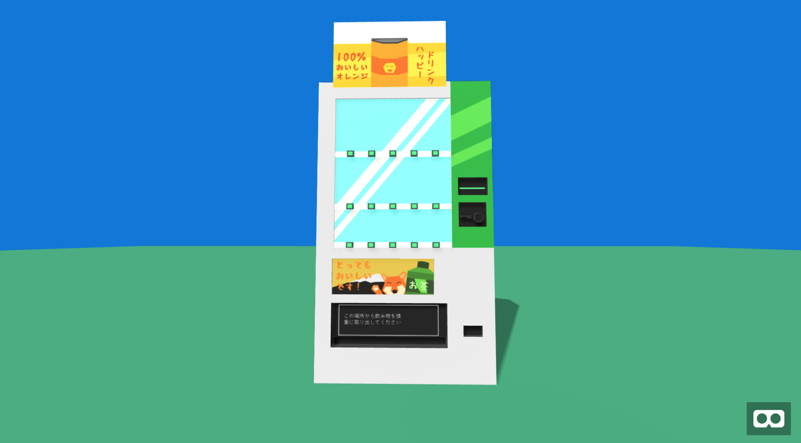

### Prerequisites

- You need [node](https://nodejs.org/en/download/current/) installed.

## TL;DR
```bash
make
```
That will build from source, and then start the server.

### Building & Zipping

```bash
make build
```

### Start server


```bash
make server
```

This will setup a server listening at `http://localhost:8080/`.


### Original Model



# JS13K A-Frame Boilerplate

This project started as a boilerplate based on [A-Frame](https://aframe.io/) and [Webpack](https://webpack.js.org/) for the [js13k competition](https://2019.js13kgames.com/).


## License

This project is licensed under the MIT License - see the [LICENSE](LICENSE) file for details

## References

* This project is based on [https://github.com/sz-piotr/js13k-webpack-starter](https://github.com/sz-piotr/js13k-webpack-starter) by Piotr Szlachciak.


# Study - Reducing the size of an existing model.

The model is a cute [Vending Machine](https://sketchfab.com/3d-models/vending-machine-242eaa6efeb3457a96a5086039583966)

* GLB (Model + Textures): 2,663,596 bytes. (2.6MB)
	* gziped: 1,950,561 bytes (2MB)
* GLTF & BIN (Models & Textures): 1,820,832 bytes.
	* GLTF: 15,382 bytes. (16KB)
	* BIN: 150,036 bytes. (150KB)
	* Textures: 1,655,414 bytes (1.6MB)
	* gziped: 1,564,319 bytes (1.6 MB on disk)


First surprising note. The GLB file, which is the model + the textures in one file, is larger than the files seprated into a folder. I'm guessing the extra space comes from converting the files when they are added to the GLB. This is pretty good news actually. If we keep the texture images seprate, we might be able to do something creative.

## Goal: 1,000 bytes.

My goal is to get this model down to only 1,000 bytes, including textures. Quaility loss is acceptable. It feels ambisus since the file is starting from 1.8MB. I'll have to cut a lot of things out, and probably create a custom format for the files.

So where to start? There are several parts to a model file. But we don'ty actually display a model file in three.js or a-frame. We display a [Mesh](https://threejs.org/docs/#api/en/objects/Mesh).  So I'll start by focusing on the two things that make up a Mesh.

* [Geometry](https://threejs.org/docs/#api/en/core/Geometry)
* [Material](https://threejs.org/docs/#api/en/materials/Material)

Everything that is displayed in the 3D world needs at least three components. Geometry containes all of the vertices in the model. These vertices make up the points that make up the model. They are grouped into [Faces](https://threejs.org/docs/#api/en/core/Face3) . The face describes how to render the material across the three vertices that make up the face. If you have had the issue where you can only see a model from one direction, and not the other. It was because your face was inverted. Tools like Blender can automatically fix those issues in most cases.

Material describes the appearence. It is the colors, textures, filters, Alpha transparency, or even with [Skeletons for animations](https://threejs.org/docs/#api/en/objects/SkinnedMesh). In simple projects, it's a color applied over each face. But in most models, it will be several image files UV mapped over the model. That's what I want, UV mapping.

What is a UV map? It is the mapping of the faces to the texture/image. A texture is a typical 2d image. A jpeg, or png file. The UV mapping is how that 2D image is placed over the model.

So I have two main paths to optimize. The Geometry and the Material. The model file has loads of important meta data around the verties. I'll just throw all that away and see how small I can make it. That sounds easier than trying to to make images smaller, plus I need more info on how to do the UV mapping. I've never gotten that part to work before.

## Vertices

I have two goals here:
* Render a model from a array of vertices.
* Fixure out how to extract the vertices from the model file. Probably the GLTF.

### Extracting vertices from GLTF files
The great news is that GLTF files are actually JSON files. I'll just open it up in my favorate [JSON Editor](http://jsoneditoronline.org/). We can find more infomation about what these fields mean with the [documentation](https://github.com/KhronosGroup/glTF/blob/master/specification/2.0/figures/gltfOverview-2.0.0b.png)

`buffer` data is the field buffers, which refrences the BIN file.

`bufferView` adds structure (aka metadata) about the data in the `buffer`.  This model has 4 `bufferViews` defined.

`accessors` describe the values to get out of the `bufferViews`.  This model has 26 accessors, mostly describing where in the bufferView they have `VEC3`, `VEC4`, and `SCALAR` values, including min/max/default values.


So, if I want to read a GLTF & BIN file, to get the vertex list, I'm going to have to do all of this work. I wonder if there are any existing tools out there that I could use. I am not thrilled to write code needed to decode all of that. But If I want to create a tool that will take a model and export the smaller file format. I will probably have too. Although, I could probably cheat a little. I could load the original file with THREE.js, let it decode the binary into a vertex list, and get the list from that. I like that idea. It will be less fragile, (THREE.js is well tested and mainnatined) and I will have to do less work. It might mean that I need a browser however. I don't know if THREE.js can work on the command line, but it [looks possible](https://threejs.org/docs/#manual/en/buildTools/Testing-with-NPM).
